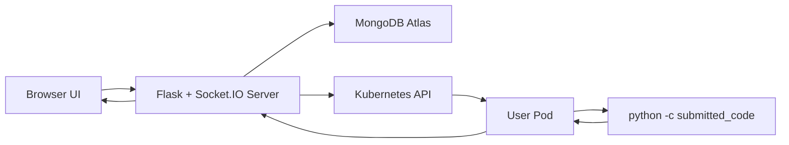
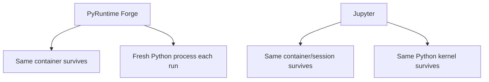
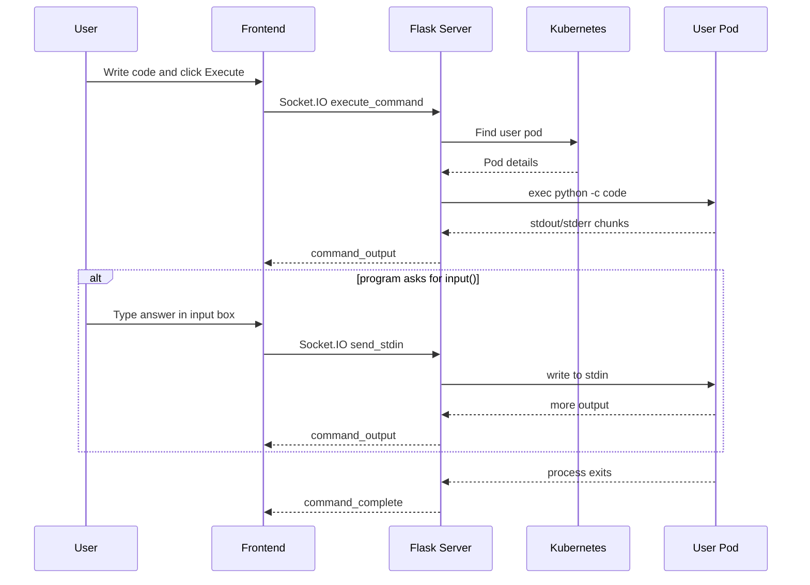

# Jupyter Vs PyRuntime Forge

This document explains the difference between a classic Jupyter-style execution model and the current PyRuntime Forge execution model.

It also includes:

- a simple architecture diagram
- the current backend flow
- the current API and WebSocket flow
- concrete examples that show what PyRuntime Forge remembers and what it forgets

---

## Short Summary

PyRuntime Forge is **container-stateful** but **not Python-RAM-stateful**.

That means:

- the user's Kubernetes pod stays alive
- files created inside the container stay available between executions
- but Python variables do not stay in memory between executions

Jupyter is both:

- container/session-stateful
- Python-kernel-stateful

That means Jupyter keeps files and Python variables alive in the same running kernel.

---

## Core Difference

### PyRuntime Forge

Current execution model:

```python
command_to_exec = ["python", "-c", command]
```

Meaning:

1. start a fresh Python process
2. run the submitted code
3. print output
4. exit the Python process

So each click on `Execute` starts a new Python interpreter.

### Jupyter

Jupyter does not start a fresh Python process for every code cell.

Instead:

1. a Python kernel starts once
2. that kernel stays alive
3. every new code cell is sent to the same kernel
4. variables, imports, and dataframes remain in RAM

---

## Simple Comparison Table

| Feature | PyRuntime Forge | Jupyter |
|---|---|---|
| User gets isolated environment | Yes | Yes |
| Container stays alive | Yes | Yes |
| Files stay between executions | Yes | Yes |
| Python variables stay in RAM | No | Yes |
| Each execution starts fresh Python process | Yes | No |
| `x = 10` then later `print(x)` works | No | Yes |
| Good for file-based workflows | Yes | Yes |
| Good for notebook-style iterative memory-based workflows | Limited | Yes |

---

## Example 1: Filesystem Statefulness

This works in PyRuntime Forge.

### Execution 1

```python
with open("demo.txt", "w") as f:
    f.write("hello")

print("file created")
```

### Execution 2

```python
with open("demo.txt", "r") as f:
    print(f.read())
```

### Result

This prints:

```text
hello
```

Reason:

The file was saved on the user's container filesystem, and the container stayed alive.

---

## Example 2: RAM Statefulness

This does **not** work in the current PyRuntime Forge design.

### Execution 1

```python
x = 12345
print("Stored x =", x)
```

### Execution 2

```python
print(x)
```

### Result

This fails with:

```text
NameError: name 'x' is not defined
```

Reason:

`x` only existed inside the previous Python process.
When the second execution started, a new Python process was created, so RAM state was lost.

---

## Why PyRuntime Forge Behaves Like This

In the current project, code is executed through Kubernetes exec using:

```python
python -c "<submitted code>"
```

That is simple and reliable, but it creates a new interpreter every time.

So the system remembers:

- files
- downloaded datasets
- generated CSV files
- saved plots
- installed libraries inside the pod

But it forgets:

- Python variables
- imported modules in memory
- loaded pandas dataframes in RAM

---

## Why This Is Still Useful

Even without RAM statefulness, PyRuntime Forge is still valuable because users get:

- isolated per-user runtime containers
- persistent files inside the pod
- repeatable execution environment
- interactive `input()` support for line-based programs
- the ability to download, save, and reuse datasets across multiple executions

This makes it useful for:

- data preprocessing workflows
- saved file analysis workflows
- teaching isolated runtime concepts
- browser-based Python practice
- user-specific sandboxed execution

---

## Architecture Diagram

### Current PyRuntime Forge Architecture



### Jupyter Architecture


### Main Conceptual Difference



---

## Current Backend Flow

The current project backend flow is:

1. User opens the app.
2. User registers using `/register`.
3. Flask stores user metadata in MongoDB Atlas.
4. Flask asks Kubernetes to create a pod/deployment for that user.
5. User logs in using `/login`.
6. Backend returns `container_id`, which is the sanitized username.
7. Frontend emits the Socket.IO event `execute_command`.
8. Backend finds the user's pod through Kubernetes labels.
9. Backend opens a Kubernetes exec session into the container.
10. Backend runs:

```python
python -c "<user code>"
```

11. Output is streamed back through Socket.IO.
12. If the running code asks for `input()`, the frontend sends follow-up stdin through Socket.IO using `send_stdin`.
13. The process finishes and the session closes.

---

## Current API Endpoints

### HTTP Routes

#### `GET /`

Purpose:

- loads the main frontend page

#### `POST /register`

Purpose:

- register a user
- create user record in MongoDB
- create Kubernetes deployment for that user

Input:

```json
{
  "username": "alice",
  "email": "alice@example.com"
}
```

Output:

```json
{
  "message": "User alice registered successfully."
}
```

#### `POST /login`

Purpose:

- lookup user by email
- return container identifier for later command execution

Input:

```json
{
  "email": "alice@example.com"
}
```

Output:

```json
{
  "container_id": "alice"
}
```

---

## Current WebSocket / Socket.IO Flow

### Incoming Events From Frontend

#### `execute_command`

Purpose:

- start execution of submitted Python code

Payload:

```json
{
  "command": "print('hello')",
  "container_id": "alice"
}
```

#### `send_stdin`

Purpose:

- send a line of input to a running Python process

Payload:

```json
{
  "input": "7"
}
```

### Outgoing Events From Backend

#### `command_started`

Purpose:

- tells the UI that command execution has started

#### `command_output`

Purpose:

- streams stdout and stderr output chunks back to the UI

Example payload:

```json
{
  "output": "Take a guess: "
}
```

#### `command_complete`

Purpose:

- tells the UI that command execution has finished

---

## Sequence Diagram For Current Execution



---

## Practical Message For Project Demo

If you want to explain your project simply in a presentation, you can say:

> PyRuntime Forge gives each user their own isolated Python container in Kubernetes.  
> The container remains alive, so files and datasets persist across executions.  
> However, each execution still starts a fresh Python process using `python -c`, so Python variables do not persist in RAM like they do in Jupyter.

---

## Final One-Line Difference

PyRuntime Forge:

> Same container, new Python process each run

Jupyter:

> Same container, same Python kernel across runs
